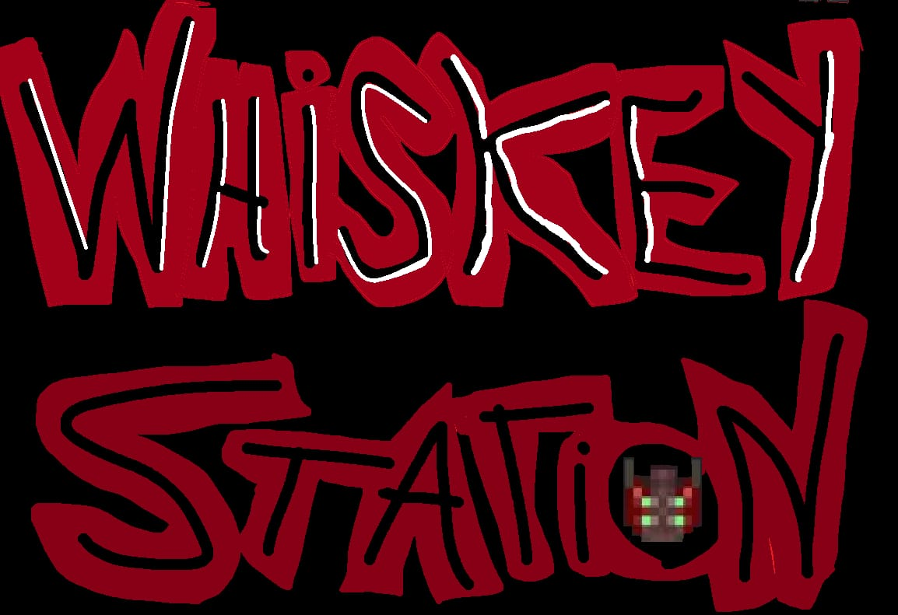
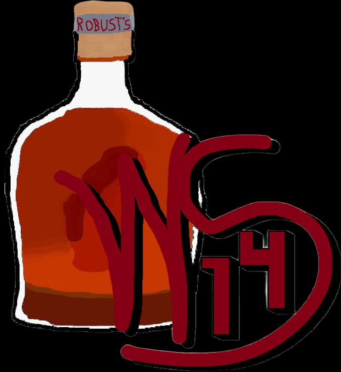

  

  

<h1 align="center">Whiskey Station</h1>

  <strong>Uma comunidade brasileira de Space Station 14 construída sobre o Trauma Station.</strong>

  <a href="https://discord.gg/cafFGGPx8">Discord</a> •
  <a href="ss14://45.154.159.111:1212/">Jogar</a> •
  <a href="https://github.com/Whiskey-Station/Whiskey-Station-14/issues">Issues</a> •
  <a href="https://docs.spacestation14.com/">Documentação do SS14</a>

## Sobre o projeto

Whiskey Station é um fork brasileiro do [Trauma Station](https://github.com/Trauma-Station/Trauma-Station), que por sua vez deriva do [Space Station 14](https://github.com/space-wizards/space-station-14). O projeto adapta essa base para a comunidade PT-BR e mantém suas mudanças públicas para que jogadores e colaboradores possam acompanhar seu desenvolvimento.

Nosso princípio é simples: **qualidade acima de tudo**. Mudanças devem ser compreensíveis, consistentes com o restante do projeto, devidamente licenciadas e verificadas antes de chegar ao servidor.

## Comunidade e documentação

- Entre no [Discord da Whiskey Station](https://discord.gg/cafFGGPx8) para acompanhar anúncios, conversar com a comunidade ou contribuir.
- Consulte a [wiki do Trauma Station](https://wiki.traumastation.com/wiki/Main_Page) para informações sobre o conteúdo herdado dessa base.
- Use a [documentação oficial do Space Station 14](https://docs.spacestation14.com/) para conteúdo técnico, engine e design de jogo.

## Contribuindo

Contribuições são bem-vindas quando preservam a estabilidade e a qualidade do projeto. Antes de abrir uma pull request:

1. Leia as [diretrizes de contribuição](CONTRIBUTING.md).
2. Procure uma tarefa na lista de [issues](https://github.com/Whiskey-Station/Whiskey-Station-14/issues) ou apresente sua proposta no Discord.
3. Mantenha a alteração focada, documente decisões relevantes e execute as validações aplicáveis.
4. Confirme a autoria e a licença de todo código, áudio, textura ou outro asset adicionado.

A localização PT-BR faz parte do escopo da Whiskey Station. Alterações de tradução devem manter terminologia, contexto e formatação consistentes.

### Qualidade e uso de IA

Não aceitamos contribuições de baixo esforço, produzidas em massa ou geradas integralmente por IA. Ferramentas assistivas não substituem autoria nem revisão: quem contribui deve compreender, revisar, testar e assumir responsabilidade por todo o conteúdo enviado.

## Compilando

1. Clone este repositório.
2. Execute `RUN_THIS.py` para inicializar os submódulos e baixar a engine.
3. Compile a solução.

O [guia de ambiente de desenvolvimento](https://docs.goobstation.com/en/general-development/setup.html) apresenta instruções detalhadas para preparar o projeto.

## Licenças

O código deste repositório é distribuído sob a licença [AGPL-3.0-or-later](LICENSES/AGPL-3.0-or-later.txt). Arquivos provenientes de outros projetos preservam suas licenças originais; os textos disponíveis estão no diretório [LICENSES](LICENSES/).

A maioria dos assets de mídia utiliza [CC-BY-SA 3.0](https://creativecommons.org/licenses/by-sa/3.0/), salvo indicação diferente no arquivo de atribuição correspondente. Alguns assets usam [CC-BY-NC-SA 3.0](https://creativecommons.org/licenses/by-nc-sa/3.0/) ou outra licença não comercial e precisam ser removidos antes de qualquer distribuição comercial.
